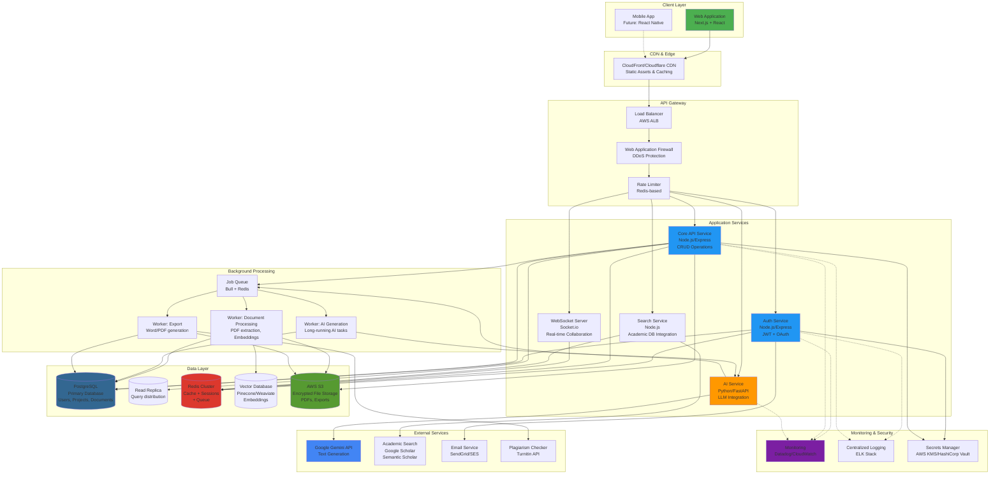

```mermaid
graph TB
    subgraph "Client Layer"
        WebApp[Web Application<br/>Next.js + React]
        Mobile[Mobile App<br/>Future: React Native]
    end

    subgraph "CDN & Edge"
        CDN[CloudFront/Cloudflare CDN<br/>Static Assets & Caching]
    end

    subgraph "API Gateway"
        LB[Load Balancer<br/>AWS ALB]
        RateLimit[Rate Limiter<br/>Redis-based]
        WAF[Web Application Firewall<br/>DDoS Protection]
    end

    subgraph "Application Services"
        Auth[Auth Service<br/>Node.js/Express<br/>JWT + OAuth]
        CoreAPI[Core API Service<br/>Node.js/Express<br/>CRUD Operations]
        AIService[AI Service<br/>Python/FastAPI<br/>LLM Integration]
        SearchService[Search Service<br/>Node.js<br/>Academic DB Integration]
        WebSocket[WebSocket Server<br/>Socket.io<br/>Real-time Collaboration]
    end

    subgraph "Background Processing"
        Queue[Job Queue<br/>Bull + Redis]
        Worker1[Worker: Document Processing<br/>PDF extraction, Embeddings]
        Worker2[Worker: AI Generation<br/>Long-running AI tasks]
        Worker3[Worker: Export<br/>Word/PDF generation]
    end

    subgraph "Data Layer"
        Postgres[(PostgreSQL<br/>Primary Database<br/>Users, Projects, Documents)]
        ReadReplica[(Read Replica<br/>Query distribution)]
        Redis[(Redis Cluster<br/>Cache + Sessions<br/>+ Queue)]
        VectorDB[(Vector Database<br/>Pinecone/Weaviate<br/>Embeddings)]
        S3[(AWS S3<br/>Encrypted File Storage<br/>PDFs, Exports)]
    end

    subgraph "External Services"
        Gemini[Google Gemini API<br/>Text Generation]
        Scholar[Academic Search<br/>Google Scholar<br/>Semantic Scholar]
        Email[Email Service<br/>SendGrid/SES]
        Plagiarism[Plagiarism Checker<br/>Turnitin API]
    end

    subgraph "Monitoring & Security"
        Monitor[Monitoring<br/>Datadog/CloudWatch]
        Logs[Centralized Logging<br/>ELK Stack]
        Vault[Secrets Manager<br/>AWS KMS/HashiCorp Vault]
    end

    WebApp --> CDN
    Mobile -.-> CDN
    CDN --> LB
    LB --> WAF
    WAF --> RateLimit
    
    RateLimit --> Auth
    RateLimit --> CoreAPI
    RateLimit --> AIService
    RateLimit --> SearchService
    RateLimit --> WebSocket

    Auth --> Postgres
    Auth --> Redis
    CoreAPI --> Postgres
    CoreAPI --> ReadReplica
    CoreAPI --> Redis
    CoreAPI --> S3
    CoreAPI --> Queue
    WebSocket --> Redis
    AIService --> Queue
    SearchService --> Redis
    
    Queue --> Worker1
    Queue --> Worker2
    Queue --> Worker3
    
    Worker1 --> S3
    Worker1 --> VectorDB
    Worker1 --> Postgres
    Worker2 --> AIService
    Worker2 --> Postgres
    Worker3 --> S3
    Worker3 --> Postgres
    
    AIService --> Gemini
    SearchService --> Scholar
    Auth --> Email
    Worker3 --> Plagiarism
    
    Auth -.-> Monitor
    CoreAPI -.-> Monitor
    AIService -.-> Monitor
    Auth -.-> Logs
    CoreAPI -.-> Logs
    Auth --> Vault
    CoreAPI --> Vault

    style WebApp fill:#4CAF50
    style Auth fill:#2196F3
    style CoreAPI fill:#2196F3
    style AIService fill:#FF9800
    style Postgres fill:#336791
    style Redis fill:#DC382D
    style S3 fill:#569A31
    style Gemini fill:#4285F4
    style Monitor fill:#7B1FA2
```